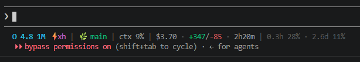

# claude-code-statusline

A compact, dependency-free status line for [Claude Code](https://code.claude.com) (Python stdlib only — no `jq`, no `node`).



```
O 4.8 1M ⚡xh | 🌿 main* | PR#12 👀 | ctx 7% | $2.17 · +194/-77 · 1h9m | 1.5h 22% · 2.7d 10%
```

## What it shows

| Segment | Example | Notes |
|---|---|---|
| Model + effort | `O 4.8 1M ⚡xh` | `Opus 4.8 (1M context)` → `O 4.8 1M`; reasoning effort abbreviated (`xhigh` → `xh`) |
| Git | `🌿 main*` | `*` = uncommitted changes; detached HEAD shown as `@abc1234` |
| Worktree | `🌳 agent-1 ← main` | 🌳 = linked worktree (detected via `git rev-parse --git-dir` vs `--git-common-dir`); `← main` = source branch in `--worktree` sessions |
| Multi-repo | `🌿 gkmux:main* · 🌳 cmux:agent-1` | one entry per repo when dirs are added via `/add-dir`, deduped by repo root |
| Open PR | `PR#12 👀` | ✅ approved · ❌ changes requested · 📝 draft · 👀 pending; disappears when the PR merges |
| Context | `ctx 7%` | context window usage |
| Session | `$2.17 · +194/-77 · 1h9m` | cost, lines added/removed, duration |
| Rate limits | `1.5h 22% · 2.7d 10%` | time until the 5-hour / 7-day window resets + used %; countdown turns yellow at ≥70% used, red at ≥90% (Pro/Max only) |

Segments with no data (no git repo, no open PR, no subscription limits) are skipped — no empty placeholders.

## Install

Requirements: `python3` (any 3.6+, stdlib only) and `git`.

```bash
curl -o ~/.claude/statusline.sh https://raw.githubusercontent.com/ggkguelensan/claude-code-statusline/main/statusline.sh
chmod +x ~/.claude/statusline.sh
```

Add to `~/.claude/settings.json`:

```json
{
  "statusLine": {
    "type": "command",
    "command": "~/.claude/statusline.sh",
    "refreshInterval": 60
  }
}
```

`refreshInterval` keeps the rate-limit countdown and the dirty indicator ticking while the session is idle; drop it if you only want event-driven updates.

> The file is a Python script despite the `.sh` extension — the shebang (`#!/usr/bin/python3`) does the work. Adjust the shebang if your `python3` lives elsewhere.

## Test without Claude Code

```bash
echo '{"model":{"display_name":"Opus 4.8 (1M context)"},"effort":{"level":"xhigh"},"workspace":{"current_dir":"."},"context_window":{"used_percentage":7},"cost":{"total_cost_usd":2.17,"total_lines_added":194,"total_lines_removed":77,"total_duration_ms":4140000}}' | ~/.claude/statusline.sh
```

## Customizing

The script is a single file with one section per segment — delete or reorder `segments.append(...)` blocks freely. The full JSON input schema is documented in the [official statusline docs](https://code.claude.com/docs/en/statusline); notable fields not used here: `thinking.enabled`, `exceeds_200k_tokens`, cache token counts (`context_window.current_usage.cache_read_input_tokens`), `agent.name`, `session_name`, `vim.mode`.

## License

[MIT](LICENSE)
